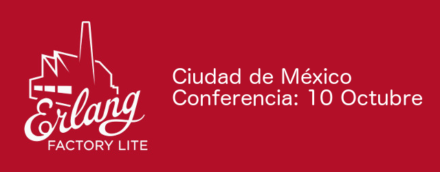

El próximo 10 de octubre se llevará a cabo el evento **Erlang Factory Lite** en la ciudad de México. Esta vez tendremos la fortuna de tener en nuestro país una versión de Erlang Factory para conocer un poco el mundo de Erlang.

Habrá excelentes ponentes, tal vez la más interesante será la plática compartida por [Jose Valim](https://twitter.com/josevalim), y no porque sea un extranjero si no porque es el creador del lenguaje de programación [Elixir](http://elixir-lang.org/) y de los principales desarrolladores del framework [Phoenix](http://www.phoenixframework.org/). Jose Valim también fue uno de los principales desarrolladores core de Rails, y fue nombrado el usuario Erlang de este año. Así que esta conferencia tiene mucho que dar.

Otra ponencia que será muy buena, será la compartida por el buen [Norberto Ortigoza](https://twitter.com/hiphoox), quien tiene mas de 20 años de experiencia y actualmente es instructor iOS en Big Nerd Ranch, así como instructor de Elixir/Erlang, pero tiene una experiencia sorprendente en Smalltalk, Objective-C, Java, C#, C, Python, Go y Elixir.

Además tendremos otras ponencias como la que tendrá [Erick Camacho](https://twitter.com/ecamacho), muy conocido en el mundo Java, que nos platicará sobre **las aplicaciones OTP con Elixir**. OTP es una de las características más interesantes de Erlang y en su charla nos platicará qué beneficios podemos obtener de este framework.

Además de estos ponentes habrá otras charlas muy interesantes que pueden revisar [aquí](http://www.erlang-factory.com/mexico2015/#speakers).

Así que, ¿qué esperan? Registrense y vayamos a [Erlang Factory](http://www.erlang-factory.com/mexico2015/home), estos son de los eventos que no se pueden perder.